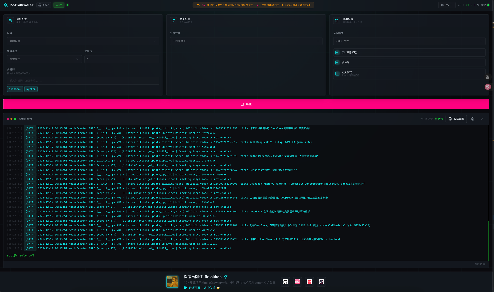

## MediaCrawler

多平台自媒体公开信息采集工具（学习/研究用途），支持小红书、抖音、快手、B站、微博、贴吧、知乎等平台的内容与评论抓取。

> 本项目仅用于学习与研究，请遵守当地法律法规、目标平台条款与合理爬取频率。完整免责声明见文末。

### 功能简历（你把它当“产品简历”就行）

- **支持平台**：XHS（小红书）/ DY（抖音）/ KS（快手）/ Bili（B站）/ WB（微博）/ Tieba（贴吧）/ Zhihu（知乎）
- **抓取能力**：关键词搜索、指定帖子抓取、创作者主页抓取、一级/二级评论（可配置）
- **登录能力**：Playwright 自动化登录（二维码/手机号/Cookie），支持保存登录态避免重复登录
- **反爬应对（学习向）**：复用登录态浏览器上下文获取必要参数，尽量避免“硬逆向”签名算法
- **并发与稳定性**：异步并发抓取 + 重试策略（Tenacity），支持限速/休眠参数
- **存储**：JSON/JSONL/CSV/Excel/SQLite/MySQL/PostgreSQL/MongoDB（按配置选择）
- **可选能力**：IP 代理池、评论词云、WebUI（FastAPI）

### 亮点

- **工程化结构清晰**：`main.py` 统一入口 + `CrawlerFactory` 按平台解耦；`media_platform/<platform>/` 维护各平台实现
- **可扩展**：新增平台/抓取类型主要在平台模块内扩展，不影响整体入口
- **可视化操作**：提供 API + WebUI，适合非命令行用户

## 工作流（以小红书为例）

1. Playwright 启动浏览器（可保存登录态）
2. 登录（二维码/手机号/Cookie）
3. 按 `--type` 执行：
   - `search`：关键词 → 笔记列表 → 笔记详情 → 评论/二级评论
   - `detail`：指定笔记 URL → 详情 → 评论
   - `creator`：创作者主页 URL → 作者信息 → 笔记列表 → 详情 → 评论
4. 按 `--save_data_option` 保存到文件或数据库

## 快速开始（Windows 推荐 uv）

### 依赖

- Node.js：>= 16
- Python：建议 3.11（以项目依赖为准）

### 安装

```powershell
cd MediaCrawler-main
uv sync
uv run playwright install
```

### 运行（示例）

```powershell
# 关键词搜索抓取
uv run main.py --platform xhs --lt qrcode --type search

# 指定笔记抓取（从 config/xhs_config.py 读取 URL 列表）
uv run main.py --platform xhs --lt qrcode --type detail

# 查看更多参数
uv run main.py --help
```

<details>
<summary>🖥️ <strong>WebUI 可视化界面</strong></summary>

MediaCrawler 提供了基于 Web 的可视化操作界面，无需命令行也能轻松使用爬虫功能。

#### 启动 WebUI 服务

```shell
# 启动 API 服务器（默认端口 8080）
uv run uvicorn api.main:app --port 8080 --reload

# 或者使用模块方式启动
uv run python -m api.main
```

启动成功后，访问 `http://localhost:8080` 即可打开 WebUI 界面。

#### WebUI 功能特性

- 可视化配置爬虫参数（平台、登录方式、爬取类型等）
- 实时查看爬虫运行状态和日志
- 数据预览和导出

#### 界面预览



</details>

<details>
<summary>🔗 <strong>使用 Python 原生 venv 管理环境（不推荐）</strong></summary>

#### 创建并激活 Python 虚拟环境

> 如果是爬取抖音和知乎，需要提前安装 nodejs 环境，版本大于等于：`16` 即可

```shell
# 进入项目根目录
cd MediaCrawler

# 创建虚拟环境
# 我的 python 版本是：3.11 requirements.txt 中的库是基于这个版本的
# 如果是其他 python 版本，可能 requirements.txt 中的库不兼容，需自行解决
python -m venv venv

# macOS & Linux 激活虚拟环境
source venv/bin/activate

# Windows 激活虚拟环境
venv\Scripts\activate
```

#### 安装依赖库

```shell
pip install -r requirements.txt
```

#### 安装 playwright 浏览器驱动

```shell
playwright install
```

#### 运行爬虫程序（原生环境）

```shell
# 项目默认是没有开启评论爬取模式，如需评论请在 config/base_config.py 中的 ENABLE_GET_COMMENTS 变量修改
# 一些其他支持项，也可以在 config/base_config.py 查看功能，写的有中文注释

# 从配置文件中读取关键词搜索相关的帖子并爬取帖子信息与评论
python main.py --platform xhs --lt qrcode --type search

# 从配置文件中读取指定的帖子ID列表获取指定帖子的信息与评论信息
python main.py --platform xhs --lt qrcode --type detail

# 打开对应APP扫二维码登录

# 其他平台爬虫使用示例，执行下面的命令查看
python main.py --help
```

</details>


## 数据保存

支持多种存储方式（CSV/JSON/JSONL/Excel/SQLite/MySQL/PostgreSQL/MongoDB）。

详细说明见：[docs/data_storage_guide.md](docs/data_storage_guide.md)

## 参考

- **小红书签名仓库**：[Cloxl 的 xhs 签名仓库](https://github.com/Cloxl/xhshow)
- **小红书客户端**：[ReaJason 的 xhs 仓库](https://github.com/ReaJason/xhs)
- **短信转发**：[SmsForwarder 参考仓库](https://github.com/pppscn/SmsForwarder)
- **内网穿透工具**：[ngrok 官方文档](https://ngrok.com/docs/)


## 免责声明

<details>
<summary><strong>点击展开</strong></summary>

<div id="disclaimer"> 

## 1. 项目目的与性质
本项目（以下简称“本项目”）是作为一个技术研究与学习工具而创建的，旨在探索和学习网络数据采集技术。本项目专注于自媒体平台的数据爬取技术研究，旨在提供给学习者和研究者作为技术交流之用。

## 2. 法律合规性声明
本项目开发者（以下简称“开发者”）郑重提醒用户在下载、安装和使用本项目时，严格遵守中华人民共和国相关法律法规，包括但不限于《中华人民共和国网络安全法》、《中华人民共和国反间谍法》等所有适用的国家法律和政策。用户应自行承担一切因使用本项目而可能引起的法律责任。

## 3. 使用目的限制
本项目严禁用于任何非法目的或非学习、非研究的商业行为。本项目不得用于任何形式的非法侵入他人计算机系统，不得用于任何侵犯他人知识产权或其他合法权益的行为。用户应保证其使用本项目的目的纯属个人学习和技术研究，不得用于任何形式的非法活动。

## 4. 免责声明
开发者已尽最大努力确保本项目的正当性及安全性，但不对用户使用本项目可能引起的任何形式的直接或间接损失承担责任。包括但不限于由于使用本项目而导致的任何数据丢失、设备损坏、法律诉讼等。

## 5. 知识产权声明
本项目的知识产权归开发者所有。本项目受到著作权法和国际著作权条约以及其他知识产权法律和条约的保护。用户在遵守本声明及相关法律法规的前提下，可以下载和使用本项目。

## 6. 最终解释权
关于本项目的最终解释权归开发者所有。开发者保留随时更改或更新本免责声明的权利，恕不另行通知。
</div>

</details>
